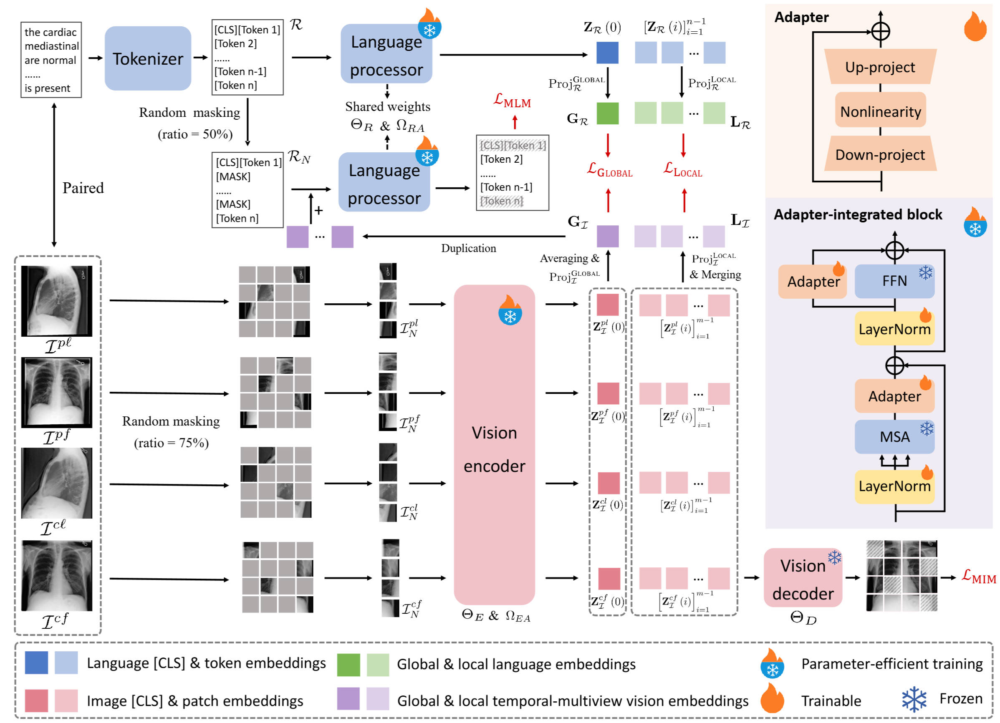

# Efficient medical vision-language alignment through adapting masked vision models (ALTA)
This is the official code for the paper: Efficient medical vision-language alignment through adapting masked vision models (TMI 2025).

## Getting started
### 1 Requirement
OS: Ubuntu 20.04 LTS.

Language: Python 3.10.8

If you are using conda, we provide an easy way to continue:

      conda env create -f environment.yaml
      pip install -r requirements.txt

### 2 Data preparation
- We use MIMIC-CXR-JPG for pre-training. You can acquire more information about this dataset at [Johnson et al. MIMIC-CXR-JPG](https://physionet.org/content/mimic-cxr-jpg/2.0.0/).
- The dataset directory specified in run.sh includes the MIMIC-CXR-JPG dataset and you need to prepare files "train.csv" according to the paper, then put them into the dateset directory [MIMIC-CXR_dataset](MIMIC-CXR_dataset).
- The file "train.csv" includes many columns for each line, including: image_path, auxview_image_path, last_image_path, last_auxview_image_path, report, which stands for the path of current frontal image, current lateral image, prior frontal image, prior lateral image, and the content of report, respectively.
- Besides, the validation set of RSNA Pneumonia dataset is used for validation, please put the dataset into the directory of [RSNA_dataset](RSNA_dataset). The dataset can be downloaded from https://www.kaggle.com/competitions/rsna-pneumonia-detection-challenge, 

### 3 Pre-trained models preparation

- Get pre-trained weights of [MRM](https://github.com/RL4M/MRM-pytorch) and put the file into [vision_encoder_weights](vision_encoder_weights).

- Get pre-trained language model from [BiomedVLP-CXR-BERT-specialized](https://huggingface.co/microsoft/BiomedVLP-CXR-BERT-specialized) and put the files into the current directory.

### 4 Start Training

- Set the data path, GPU IDs, batch size, output directory, and other parameters in [run.sh](run.sh).

- Start training by running

      chmod a+x run.sh
      ./run.sh

### 5 Evaluation
Here we provide the trained weights of ALTA, you can download it from [Google Drive](https://drive.google.com/file/d/1glNAfI3URUtSjHNGcfIUNr5Wk3tqa_1P/view?usp=drive_link) and put it into the directory of [ALTA_weights](ALTA_weights).
#### 5.1 Image-to-image retrieval on CheXpert 8×200
- Prepare the dataset following [convirt](https://github.com/yuhaozhang/convirt) and put the directories of "image-retrieval" and "text-retrieval" into [CheXpert8X200_dataset](CheXpert8X200_dataset).
- Run

      python CheXpert8X200_img2img.py

#### 5.2 Text-to-image retrieval on CheXpert 8×200
- The dataset has been prepared in 5.1.
- Run

      python CheXpert8X200_img2img.py

#### 5.3 Image-to-text retrieval on CheXpert 5×200
- We have generated [chexpert_5x200.csv](CheXpert5X200_dataset/chexpert_5x200.csv) by the codebase of [gloria](https://github.com/marshuang80/gloria/blob/main/gloria/datasets/preprocess_datasets.py)
- Run

      python CheXpert5X200_retrieval.py

#### 5.4 Zero-shot classification on CheXpert 5×200
- The dataset has been prepared in 5.3.
- Run

      python CheXpert5X200_zeroshot.py

#### 5.5 Zero-shot classification on RSNA
- The dataset has been prepared in [2 Data preparation](#2-data-preparation).
- Run

      python RSNA_zeroshot.py

## Acknowledgments
Some code of this repository is borrowed from [MAE](https://github.com/facebookresearch/mae), [MRM](https://github.com/RL4M/MRM-pytorch), [AIM](https://adapt-image-models.github.io/), [GLoRIA](https://github.com/marshuang80/gloria/) and [huggingface](https://huggingface.co).

## License
This project is under the CC-BY-NC 4.0 license. See [LICENSE](LICENSE) for details.